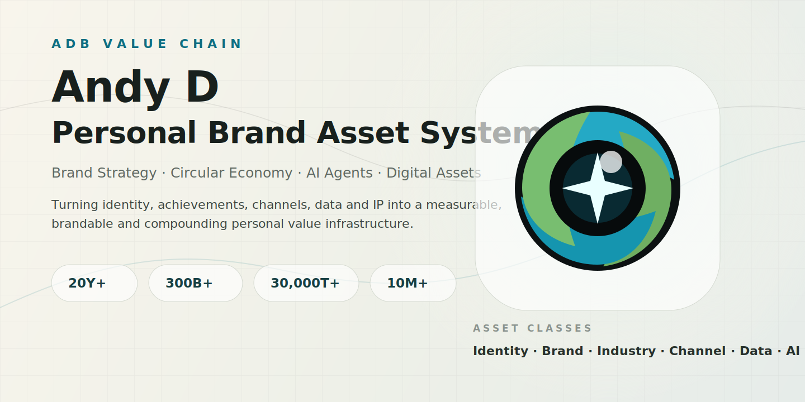

# Andy D | Personal Brand Asset System

**Andy D / Dong Yunhe** is a multidisciplinary brand strategist, circular-economy operator, AI application practitioner and personal-IP architect. This repository presents his personal brand as a structured digital asset system rather than a conventional resume.

The website transforms professional experience into a measurable, brandable and compounding value infrastructure. It connects 20+ years of work across group brand governance, market growth, recycling and circular-economy systems, ESG data, public-benefit IP, social media operations, AI agents, digital content and project investment.

At its core, this is a personal assetization project: identity, achievements, projects, channels, data, IP, tools and commercial judgment are organized into a visible value chain that can be understood, verified, remembered and converted into collaboration.

## Positioning

Andy D is positioned as a high-value operator and personal brand builder with expertise in:

- **Brand Strategy and Brand Governance**: group-level brand management, product-brand architecture, multi-format brand systems, major public events, corporate websites and personal IP.
- **Circular Economy and Recycling Systems**: urban recycling networks, front-end recovery stations, ESG data assets, public-sector coordination, secure destruction and green supply-chain projects.
- **Channel and Community Assets**: government, subdistricts, communities, malls, brand alliances, MCN networks, KOL communities, public-benefit campaigns and international social platforms.
- **Digital Products and AI Execution**: AI agents, workflow automation, knowledge-base systems, smart dashboards, Notion / Obsidian synchronization, Feishu Base design and content automation.
- **Content and Personal Media Assets**: StarEpoch, digital avatar identity, AI music catalog, WeChat official account, video platforms, Xiaohongshu, Douyin, Facebook and X.
- **Project Investment and Commercial Judgment**: education, MCN, cross-border live commerce, AI applications, design, advertising, agriculture and community sports service models.

## Core Narrative

This project translates career achievements into an asset ledger:

> Personal value is not only experience. It is a brandable, verifiable and compounding asset system.

Each metric, project, IP property, channel, research output and agent workflow is treated as an asset block. The goal is to make professional credibility visible, searchable, memorable and commercially actionable.

## Personal Asset Framework

The brand system is organized around eight asset classes:

| Asset Class | Professional Meaning |
| --- | --- |
| **Identity Asset** | Andy D, StarEpoch, digital avatar identity, cross-cultural education and multilingual capability |
| **Brand Asset** | Brand governance, product-brand architecture, corporate websites, major events and personal IP |
| **Industry Asset** | Urban circular systems, recycling infrastructure, ESG scenarios and secure destruction services |
| **Channel Asset** | Government, communities, malls, media, MCN resources, brand alliances and international platforms |
| **Data Asset** | Category, weight, station, ESG, reach, participation and reporting data converted into dashboards |
| **AI Asset** | Agent workflows, Codex, OpenClaw, Hermes, n8n, Coze, Notion, Obsidian and automation systems |
| **Content Asset** | StarEpoch, official account, video channels, AI music, social content and digital publishing |
| **Project Investment Asset** | Education, MCN, live commerce, AI applications, design, advertising, agriculture and community sports |

## Key Signals

- 20+ years of brand, market, industry, channel and AI application practice
- 300B+ group brand value support experience
- 300M+ annual sales scale participation for a single product-brand case
- 6,262 participants in a Guinness World Record event
- 30,000T+ cumulative recycling volume across circular systems
- 300+ public-benefit recycling stations in Tianjin
- 100+ zero-waste public market activations
- 10M+ public-benefit media impressions
- 5 AI music albums and 93 songs
- Business model replication across Xi'an, Guangzhou and Harbin

## Design Direction

The website uses a cinematic scrolling structure, trilingual content, glassmorphism cards, timeline-based value mapping and animated visual assets to express the idea of a living personal asset organism.

## Local Preview

```bash
npm install
npm run dev
```

## Build

```bash
npm run build
```

The production build is generated in `dist/`. The default language is English.

## GitHub Pages

This repository includes a GitHub Actions workflow at `.github/workflows/deploy-pages.yml`.
After pushing to `main`, GitHub Pages can publish the generated site from the workflow artifact.
